Creating a Windows and Linux Virtual Machine in the Cloud (Microsoft Azure)
In this walkthrough, we will create a Windows and Linux virtual machine (VM) in Azure. This skill set will be vital and is a key component to all of the IT projects listed.
Prerequisite
Microsoft Azure account
Environments and Technologies Used
Microsoft Azure (Virtual Machines/Compute)
Operating Systems Used
macOS Sequoia
Windows 10 Pro (21H2)
Ubuntu Server 22.04
High-Level Steps
Step 1: Create a Resource Group in Azure
Step 2: Create the Windows VM in Azure
Step 3: Create the Linux VM in Azure
Walkthrough Demonstration
Step 1: Create a Resource Group in Azure
CVM RG1

- After creating an account with Microsoft Azure and getting logged in, you will end up at the Quickstart Center screen. Welcome to Azure!

CVM RG2

- Locate the Search Bar at the top of your screen. We will use this to find the Resourse Groups. Notice the options that populate as you type "resource" into the search bar. Select Resource Groups.

CVM RG3

- Oops! The resource groups seem to be missing... Have no fear, IT is here! 😎 Click the + Create button and let's get this party started!

CVM RG4

The Subscription box should reflect whatever you chose when setting up your Azure account. If you do not see that, click the drop down arrow to find it.

Now, name your Resource Group (RG). This RG is where our VMs will be stored in the Cloud.

Next, choose the Region. Pro Tip: Select (US) East US 2 for ALL Region options. Making sure the Region matches for eveything we create will save you from future headaches. Now click next at the bottom of the screen.

CVM RG5

- Review the Resource Group information and click Create. Make note of the name and region you used for future reference.

CVM RG6

- After clicking Create you will be directed back to the RG section. You have successfully created your Resource Group in the Cloud. Now let's get to the good part and the real reason we're all here. To create some VMs!

Step 2: Create a Windows VM in Azure
CVM 1

- From this screen, locate the search bar again and enter "virtual". Select "Virtual machines" from the options populated. This will direct you to the Virtual Machines section.

CVM 2

- Simply click the + Create button to get started. (Simular to when we created the Resource Group)

CVM 3

- Select the first option, "Azure virtual machine" from the drop down and click + Create button.

CVM 5

- Your subscription should already be selected.

Choose the RG we created earlier.

Name the VM "windows-vm".

Select the same Region as before. "(US) East US 2". We want the RG and Region to be the same for everything we are creating.

Select "Windows 10 Pro, version 22H2" for the Image. This will be the Operating System (OS) for the VM. Do Not select a Windows Server

- Scroll down to select the Size. We want to use the "Standard_D2s_v5 - 2 vcpus, 8 GiB memory".

- If you do not see this listed, click "See all sizes" to get more options. Sometimes the Region selected can cause this specific size to not populate. That is okay. Just make sure the size you pick has at least 2 vcpus and 8 GiB memory. This will be plenty of power to handle what we are doing. 😉

CVM 7

- Next, you will create a username and password for the VM. We will need this to log on later with a Remote Desktop Connection (RDP). *Highly recommend saving this infomation to refer back to later.*

- Now, locate the Licensing area towards the bottom of the screen. You will need to check the box to confirm. This is required because we are creating a Windows VM. Deployment will not work if left unchecked. Click "Next: Disks" to move on.

CVM 8

- We will leave the Disks settings at Default for what we are doing, but you can see all the differnet options Azure provides. Click "Next: Networking" to move on to Networking. This is where we will set the Vitrual Network for the VM.

CVM 9

- Azure may auto populate a Network name for you. Go ahead and create a new one with a name of your choosing. Just note what you named the Network to refer back to later. We will need it for the Linux VM. You can leave the rest at Default setting. Azure will automatically assign the Subnet and Public IP for you. Leave the RDP Port as well. We will need access the VM via Remote Desktop Connection later. Click "Review + create" button.

CVM 10

- Review all the informatiom for the Windows VM. Our Subsciption, RG, and Region are correct. We named the VM "windows-vm". The Image and Size are correct and we have RDP active. Simply click "Create".

CVM 11

- Once you click "Create", the Deployment of the Windows VM will begin. Grab a snack or something to drink beacuse this can take a few minutes. When you come back from snacking, you will see "Your deployment is complete". Congrats! We just created our first Virtual Machine in the Cloud but let's not get too excited. There is still work to be done. Click "Create another VM" to get started on the Linux VM.

Step 3: Create a Linux VM in Azure
CVM 12

- Hey, this screen looks familiar... Select the same RG that we created earlier. Name the VM "linux-vm" and choose the same Region as before. Again, this will save you headaches in the future.

CVM 13

- Since this will be the Linux VM, select "Ubuntu Server 22.02" for the Image.

CVM 14

- Choose the same Size option as before. "Standard_D2s_v5 - 2 vcpus, 8 GiB memory".

- Next, you will need to select "Password" for Authentication type. Azure defaults to SSH public key. Then, create a Username and Password. You can use information as the Windows VM to keep it simple.Once you are done, scroll done and click "Disks". Leave these options as default and skip to "Networking".

CVM 15

- Make sure to select the same Virtual Network that we created earlier. We can leave everything else as default. Scroll down and click "Review + create".

CVM 16

- On the next screen you will see the deployment of the Linux VM in progress. Time for second snack. This may take a few minutes.

CVM 17

- The Linux VM has been successfully created. Let's Go! Locate the search bar at the top of the screen and type in "virtual". Select "Virtual machines" and you will be direct to your newly created VMs!

CVM 18

- You can view the Windows and Linux VMs we created in the Cloud. You will notice the RG and Locations match, what OS they are running, Public IP addresses, and so much more...

*Pro Tip: Notice the Start, Restart, and Stop buttons above the OS and Size area. You can use these to "turn off", "turn on" , or "restart" the VMs like you would your physical PC or Laptop. To save on your subsricption, you can "Stop" the VMs from running while you are not using them. Just make sure to "Start" them when you are ready to use them again. If you want extra practice, you can simply delete the RG and recreate everything as needed.*

Conclusion
This concludes our project. We sucessfully created a Resource Group, a Windows VM running Windows 10 Pro, and a Linux VM running Unbutu in the Cloud. We got to learn and witness the many possibilties of what Cloud Computing and Virtualization offers. Now, we essentilly have three machines in total to use how we want for our IT needs.

I completed this from a Macbook and have gained access to 2 other machines running a differnet OS without taking up any desk space or shelling out thousands of dollars. You can clearly see the many benefits that companies gain from using Cloud Services and Cloud Service Providers (CSP). Don't forget to Stop (turn off) the VMs in Azure. Thank You for your time and viewing this Project. We'll see you on the next one! 😎

# My Azure Learning Project

## 📋 Steps I Followed

1. **Created an Azure Account**  
   I signed up for a [Free Azure Subscription](https://azure.microsoft.com/en-us/free/). You can also choose Pay-As-You-Go.

2. **Logged into the Azure Portal**  
   Accessed the portal at [portal.azure.com](https://portal.azure.com) to start working with cloud resources.

3. **Explored the Azure Portal**  
   Got familiar with key services like:  
   - **Resource Groups** – to organize resources  
   - **Virtual Machines** – for cloud-based computing  
   - **Entra ID** – for identity and access management

4. **Created a Resource Group**  
   Made a new Resource Group to keep everything organized.

5. **Set Up a Storage Account**  
   Created a Storage Account inside the Resource Group to manage files and blobs.

6. **Created a Local Text File**  
   Made a `.txt` file on my Mac desktop using TextEdit (switched to *Plain Text* mode).

7. **Uploaded the File to Azure**  
   Uploaded the text file to a Blob Container in my Storage Account via the Azure Portal.

8. **Edited the File in the Portal**  
   Used the built-in editor in Azure to make and save changes directly.

9. **Downloaded and Reviewed the File**  
   Downloaded the edited file and confirmed the changes were applied.

10. **Deleted the Resource Group**  
    Deleted the entire Resource Group to remove all resources and avoid charges.

11. **Checked Cost Management**  
    Went to *Cost Management > Cost Analysis* to confirm there were no remaining costs.

# 🚀 Azure Hands-On Setup (via Portal + CLI)

This repo documents how I set up and managed resources on Azure using the Azure Portal and the CLI.

---

## 🔧 What I Did

### 1. Create Azure Account  
👉 [Sign up here](https://azure.microsoft.com/en-us/free/)

---

### 2. Login to Azure via CLI

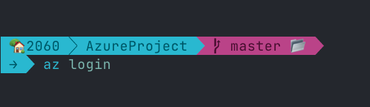

---

### 3. Create a Resource Group

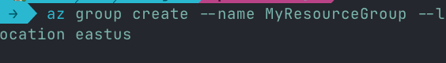

---

### 4. Create a Storage Account

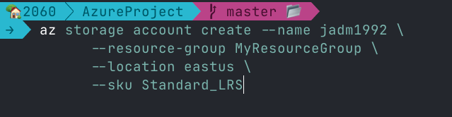

---

### 5. Create a Container

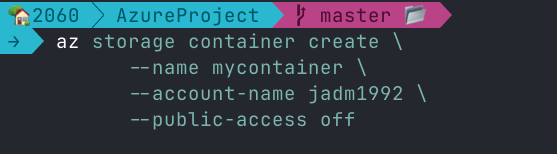

---

### 6. Upload a File

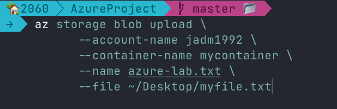

---

### 7. Edit the File in NEOVIM

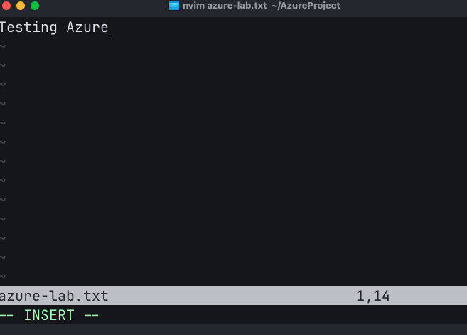

OR 

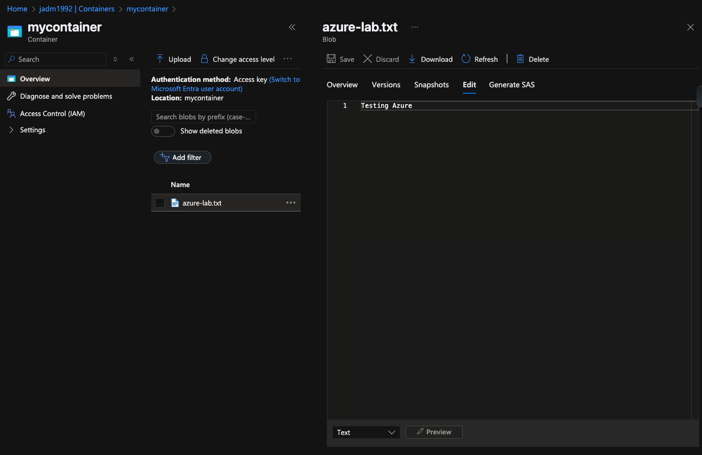

---

### 8. Download the File (to verify edits)

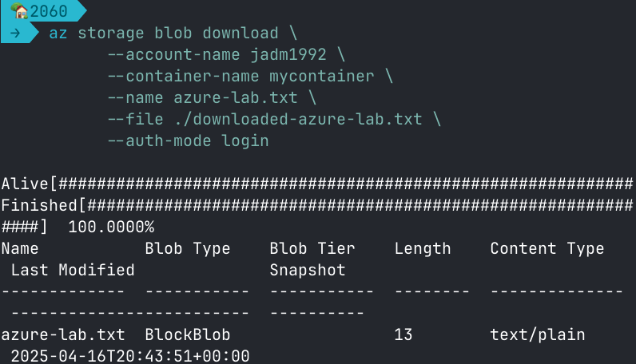

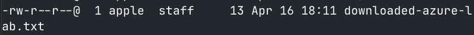

---

### 9. Delete the Resource Group (Clean-up)

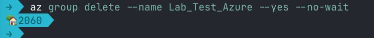

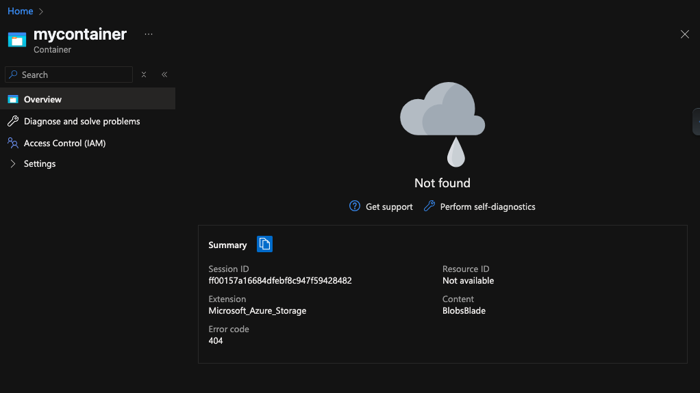

---

### 10. Check for Costs

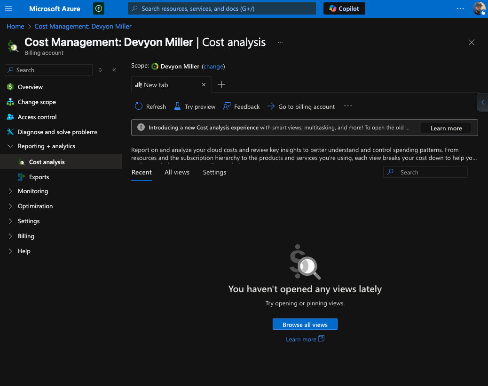

---
